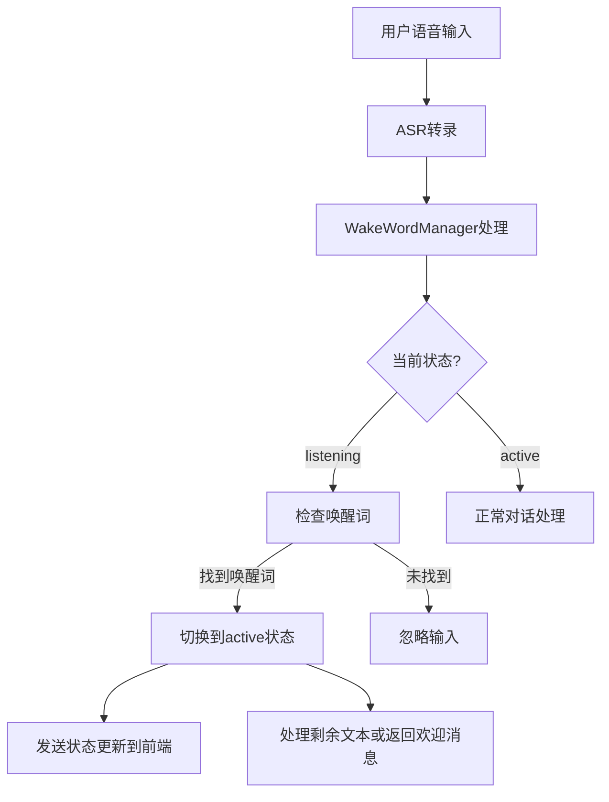
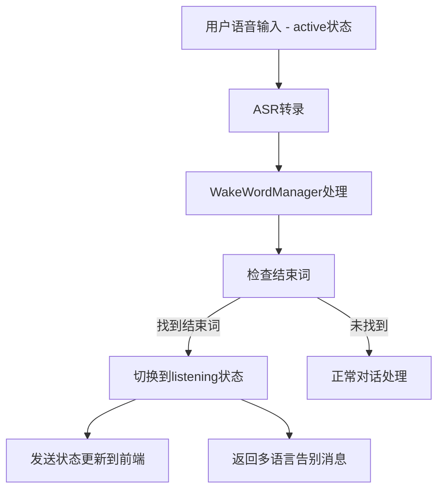

# 🎤 多语言唤醒词系统 - 功能说明文档

## 📋 **功能概述**

本系统实现了一个优雅的多语言唤醒词功能，支持中文、英文、日文的语音唤醒和结束命令。该系统采用零侵入设计，不破坏现有架构，可以随时启用或禁用。

## 🌟 **核心特性**

### **多语言支持**
- **中文**: 心海、珊瑚宫心海、嘿心海、你好心海、心海同学、心海大人、心海酱、小助手、kokomi
- **English**: Kokomi, Hey Kokomi, Hello Kokomi, Sangonomiya, Assistant, Hey assistant, Computer, AI
- **日本語**: ココミ、心海、アシスタント、こんにちはココミ、ココミちゃん、助手、おーい、ねえ、珊瑚宮心海

### **结束词支持**
- **中文**: 结束、再见、拜拜、停止、结束对话、谢谢、不聊了、够了、好了、结束吧、下次见
- **English**: goodbye, bye, end, stop, finish, thanks, that's all, see you, later, quit, exit
- **日本語**: さようなら、バイバイ、終わり、停止、やめて、ありがとう、また今度、じゃあね、おつかれ、終了

### **智能状态管理**
- **监听模式 (listening)**: 等待唤醒词，忽略其他语音输入
- **激活模式 (active)**: 正常对话处理，直到检测到结束词

## 🏗️ **架构设计**

### **设计原则**
- ✅ **零侵入**: 不修改现有核心逻辑
- ✅ **独立模块**: `WakeWordManager` 完全独立运行
- ✅ **可配置**: 支持动态启用/禁用
- ✅ **多客户端**: 每个客户端独立状态管理
- ✅ **向后兼容**: 现有功能完全不受影响

### **核心组件**

#### **1. WakeWordManager (`src/solvia_for_chat/conversations/wake_word_manager.py`)**
```python
class WakeWordManager:
    - 多语言唤醒词和结束词配置
    - 客户端状态管理 (listening/active)
    - 智能文本处理和语言检测
    - WebSocket状态更新
    - 统计信息收集
```

**主要方法**:
- `check_wake_words()`: 检测唤醒词
- `check_end_words()`: 检测结束词  
- `process_transcription()`: 处理ASR转录结果
- `get_welcome_message()`: 生成多语言欢迎消息
- `get_goodbye_message()`: 生成多语言告别消息

## 📦 **文件修改清单**

### **新增文件**
1. **`src/solvia_for_chat/conversations/wake_word_manager.py`** ⭐ **核心模块**
   - 多语言唤醒词管理器
   - 状态机实现
   - 智能文本处理

### **修改文件**

#### **后端修改**

2. **`src/solvia_for_chat/conversations/conversation_utils.py`**
   ```python
   # 添加导入
   + from .wake_word_manager import wake_word_manager
   ```

3. **`src/solvia_for_chat/conversations/single_conversation.py`**
   ```python
   # 添加导入
   + from .wake_word_manager import wake_word_manager
   
   # 在process_user_input后添加唤醒词处理
   + should_process, processed_text = await wake_word_manager.process_transcription(
   +     input_text, client_uid, websocket_send
   + )
   + 
   + if not should_process:
   +     return ""  # 忽略此次输入
   + 
   + input_text = processed_text  # 使用处理后的文本
   ```

4. **`src/solvia_for_chat/websocket_handler.py`**
   ```python
   # 添加导入
   + from .conversations.wake_word_manager import wake_word_manager
   
   # 在客户端断开时清理状态
   + wake_word_manager.cleanup_client(client_uid)
   ```

#### **前端修改**

5. **`frontend/Frontend-AI/src/renderer/src/services/websocket-handler.tsx`**
   ```typescript
   // 添加wake-word-state消息处理
   + case 'wake-word-state':
   +   const { action, matched_word, language, current_state, stats } = message;
   +   // 处理唤醒词状态更新和UI反馈
   ```

## 🔄 **工作流程**

### **1. 唤醒流程**


### **2. 结束流程**


## 🎛️ **配置说明**

### **启用/禁用功能**
```python
# 在代码中动态控制
wake_word_manager.set_enabled(True)   # 启用
wake_word_manager.set_enabled(False)  # 禁用
```

### **查看状态信息**
```python
status = wake_word_manager.get_status()
# 返回:
# {
#     "enabled": True,
#     "active_clients": 1,
#     "listening_clients": 0,
#     "total_clients": 1,
#     "stats": {"wake_count": 5, "end_count": 3, "ignored_count": 12},
#     "supported_languages": ["chinese", "english", "japanese"],
#     "wake_words_count": {"chinese": 8, "english": 8, "japanese": 8}
# }
```

## 📱 **前端集成**

### **WebSocket消息格式**
```typescript
interface WakeWordStateMessage {
  type: 'wake-word-state';
  client_uid: string;
  action: 'wake_up' | 'sleep' | 'ignored';
  matched_word: string;
  language: string;
  current_state: 'listening' | 'active';
  stats: {
    wake_count: number;
    end_count: number;
    ignored_count: number;
  };
}
```

### **前端处理示例**
```typescript
case 'wake-word-state':
  const { action, matched_word, language } = message;
  
  if (action === 'wake_up') {
    console.log(`✨ 唤醒词检测到: "${matched_word}" (${language})`);
    // 更新UI状态指示器
  } else if (action === 'sleep') {
    console.log(`💤 结束词检测到: "${matched_word}" (${language})`);
  }
```

## 🧪 **使用示例**

### **中文对话**
```
用户: "心海，今天天气怎么样？"
系统: ✨ 检测到唤醒词 "心海" (chinese)
AI: "你好！我是心海，有什么可以帮你的吗？今天天气..."

用户: "谢谢你，再见"  
系统: 💤 检测到结束词 "再见" (chinese)
AI: "好的，再见！有需要随时叫我。"
```

### **English对话**
```
用户: "Hey Kokomi, what time is it?"
系统: ✨ 检测到唤醒词 "Hey Kokomi" (english)
AI: "Hello! I'm Kokomi, how can I help you? The time is..."

用户: "Thanks, goodbye"
系统: 💤 检测到结束词 "goodbye" (english)
AI: "Alright, goodbye! Call me anytime you need help."
```

### **日本語対話**
```
用户: "ソルビア、元気ですか？"
系统: ✨ 检测到唤醒词 "ソルビア" (japanese)
AI: "こんにちは！ソルビアです。何かお手伝いできることはありますか？"

用户: "ありがとう、さようなら"
系统: 💤 检测到结束词 "さようなら" (japanese)  
AI: "はい、さようなら！何かあったらいつでも呼んでくださいね。"
```

## 🐛 **调试信息**

### **日志级别**
- **INFO**: 唤醒词激活/关闭事件
- **DEBUG**: 状态转换和客户端管理
- **ERROR**: 异常处理

### **日志示例**
```
2024-01-XX XX:XX:XX | INFO  | ✨ WakeWord: ACTIVATED by '心海' (chinese) - Client abc123
2024-01-XX XX:XX:XX | DEBUG | WakeWord: Client abc123 state listening -> active  
2024-01-XX XX:XX:XX | INFO  | 💤 WakeWord: DEACTIVATED by '再见' (chinese) - Client abc123
```

## 🚀 **性能优化**

### **内存优化**
- 使用扁平列表缓存所有唤醒词，避免重复遍历
- 客户端断开时自动清理状态
- 统计信息轻量级存储

### **处理效率**
- 智能大小写处理（英文）
- 优化的字符串匹配算法
- 异步处理，不阻塞主要对话流程

## 🔧 **故障排除**

### **常见问题**

1. **唤醒词不响应**
   - 检查 `wake_word_manager.enabled` 状态
   - 查看ASR转录结果是否正确
   - 确认唤醒词在配置列表中

2. **结束词无效**
   - 确认当前状态为 `active`
   - 检查结束词拼写和语言匹配

3. **状态混乱**
   - 重启应用清理所有客户端状态
   - 查看日志确认状态转换

### **调试命令**
```python
# 查看当前状态
print(wake_word_manager.get_status())

# 手动设置客户端状态
wake_word_manager.set_client_state("client_id", "active")

# 清理特定客户端
wake_word_manager.cleanup_client("client_id")
```

## 📈 **扩展建议**

1. **配置文件支持**: 将唤醒词配置移到YAML文件
2. **自定义唤醒词**: 允许用户添加个人化唤醒词
3. **语音相似度**: 集成声纹识别提高准确度
4. **UI状态指示器**: 添加可视化的唤醒状态显示
5. **统计仪表板**: 创建唤醒词使用统计页面

---

## 💡 **总结**

这个多语言唤醒词系统完美解决了杂声干扰问题，同时提供了优雅的多语言支持。系统采用零侵入设计，保持了代码的整洁性和可维护性。用户现在可以通过自然的语音命令来控制AI助手的激活和休眠，大大提升了使用体验。

**系统已就绪，开始享受智能语音交互吧！** 🎉