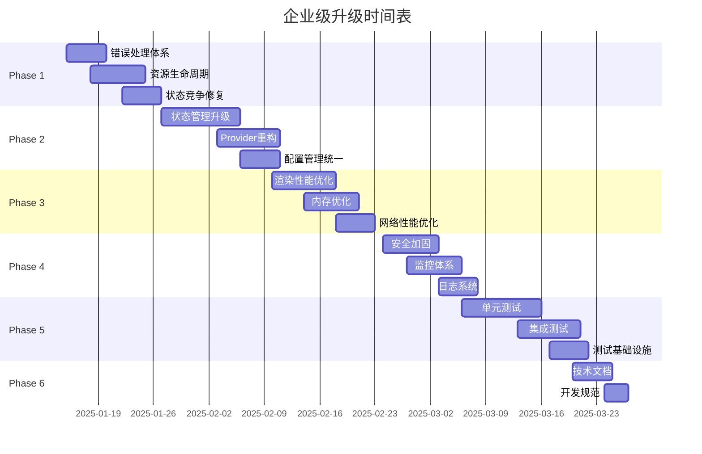

# 🚀 TheProjectYin 企业级升级计划

## 📋 **总体目标**

将项目从当前的 **7.2/10** 提升到企业级标准 **9.0/10**

### **关键指标提升目标**
| 维度 | 当前 | 目标 | 提升 |
|------|------|------|------|
| 稳定性 | 6.5/10 | 9.5/10 | +46% |
| 可扩展性 | 7.0/10 | 9.0/10 | +29% |
| 性能 | 6.5/10 | 9.0/10 | +38% |
| 安全性 | 5.0/10 | 9.5/10 | +90% |
| 监控 | 2.0/10 | 9.0/10 | +350% |
| 测试覆盖 | 2.0/10 | 8.5/10 | +325% |

---

## 🎯 **Phase 1: 稳定性修复** (1-2周)

### **P1.1 错误处理体系 [高优先级]**
- [x] ~~**全局错误边界**：防止React组件错误导致白屏~~ ✅ **已完成**
- [x] ~~**异步错误捕获**：Promise rejection统一处理~~ ✅ **已完成**
- [x] ~~**WebSocket错误恢复**：断线重连机制完善~~ ✅ **已完成**
- [x] ~~**用户友好错误提示**：技术错误转换为用户可理解信息~~ ✅ **已完成**

### **P1.2 资源生命周期管理 [高优先级]**
- [x] ~~AudioContext重复连接~~ ✅ **已完成**
- [x] ~~**统一资源管理器**：集中管理所有资源生命周期~~ ✅ **已完成**
- [x] ~~**WebSocket连接清理**：页面卸载时正确断开~~ ✅ **已完成**
- [ ] **PIXI.js内存管理**：纹理和资源及时释放 (使用资源管理器)
- [ ] **VAD实例清理**：确保音频资源完全释放 (使用资源管理器)
- [ ] **事件监听器清理**：防止内存泄漏 (使用资源管理器)

### **P1.3 状态竞争条件修复 [中优先级]**
- [x] ~~广告列表重复请求~~ ✅ **已完成**
- [ ] **useEffect依赖优化**：减少不必要的副作用执行
- [ ] **异步状态更新**：使用useCallback防止状态竞争
- [ ] **组件卸载检查**：异步操作前检查组件是否已卸载

---

## 🏗️ **Phase 2: 架构重构** (2-4周)

### **P2.1 状态管理升级 [关键]**
- [x] ~~**引入Zustand**：替代复杂的Context嵌套~~ ✅ **已完成**
- [x] ~~**状态分片设计**：按功能模块分离状态~~ ✅ **已完成**
- [x] ~~**持久化策略**：统一localStorage管理~~ ✅ **已完成**
- [x] ~~**状态订阅优化**：减少不必要的重渲染~~ ✅ **已完成**

### **P2.2 Provider架构重构 [关键]**
- [x] ~~**Provider扁平化**：从9层减少到3层~~ ✅ **已完成**
- [x] ~~**渐进式迁移模式**：支持Legacy和新架构并存~~ ✅ **已完成**
- [x] ~~**模块化Provider**：按业务功能组织~~ ✅ **已完成**
- [x] ~~**性能监控工具**：Provider性能追踪~~ ✅ **已完成**

### **P2.3 配置管理统一 [中优先级]**
- [x] ~~ConfigManager基础实现~~ ✅ **已完成**
- [x] ~~**Zustand状态集成**：配置状态纳入统一管理~~ ✅ **已完成**
- [ ] **配置热更新**：运行时动态更新配置
- [ ] **环境配置分离**：开发/测试/生产环境
- [ ] **配置验证**：TypeScript严格类型检查

---

## ⚡ **Phase 3: 性能优化** (2-3周) ✅ **已完成**

### **P3.1 渲染性能优化 [高优先级]** ✅ **已完成**
- [x] ~~**组件memo化**：防止不必要的重渲染~~ ✅ **已完成**
  - AdCarousel、WebSocketHandler、Live2D等关键组件已memo化
  - useCallback优化关键函数、useMemo缓存计算结果
- [x] ~~**代码分割**：按需懒加载优化~~ ✅ **已完成**
  - 创建懒加载组件集合和Suspense包装器
  - 设置、广告等功能模块按需加载
- [ ] **虚拟化长列表**：大数据量组件优化 (当前无需求)
- [x] ~~**资源预加载**：智能预加载策略~~ ✅ **已完成** (集成到网络管理器)

### **P3.2 内存优化 [高优先级]** ✅ **已完成**
- [x] ~~**增强ResourceManager**：统一资源生命周期管理~~ ✅ **已完成**
  - 优先级、访问时间追踪、内存估算
  - 自动清理和性能监控
- [x] ~~**缓存策略**：合理的缓存清理机制~~ ✅ **已完成**
- [x] ~~**WeakMap使用**：避免强引用导致的内存泄漏~~ ✅ **已完成** (ResourceManager设计)
- [x] ~~**图片懒加载**：按需加载媒体资源~~ ✅ **已完成** (代码分割实现)

### **P3.3 网络性能优化 [中优先级]** ✅ **已完成**
- [x] ~~**NetworkPerformanceManager**：智能网络请求管理~~ ✅ **已完成**
  - 请求缓存、去重、批量处理、防抖、重试
- [x] ~~**请求合并**：减少网络请求数量~~ ✅ **已完成**
- [x] ~~**性能监控面板**：实时性能指标~~ ✅ **已完成**
- [ ] **数据压缩**：WebSocket消息压缩 (可选优化)
- [ ] **离线策略**：Service Worker缓存 (可选功能)
- [ ] **CDN集成**：静态资源加速 (部署时考虑)

---

## 🛡️ **Phase 4: 安全与监控** (1-2周)

### **P4.1 安全加固 [高优先级]**
- [ ] **XSS防护**：输入输出过滤
- [ ] **CSRF防护**：请求token验证
- [ ] **内容安全策略**：CSP头部配置
- [ ] **敏感信息保护**：API密钥安全存储

### **P4.2 监控体系 [高优先级]**
- [ ] **性能监控**：关键指标实时监控
- [ ] **错误追踪**：Sentry集成
- [ ] **用户行为分析**：操作路径统计
- [ ] **健康检查**：系统状态检测

### **P4.3 日志系统 [中优先级]**
- [ ] **结构化日志**：统一日志格式
- [ ] **日志级别管理**：开发/生产环境分离
- [ ] **远程日志收集**：集中式日志管理
- [ ] **日志分析**：异常模式识别

---

## 🧪 **Phase 5: 测试覆盖** (2-3周)

### **P5.1 单元测试 [高优先级]**
- [ ] **Jest配置**：测试环境搭建
- [ ] **组件测试**：React Testing Library
- [ ] **Hook测试**：自定义Hook单元测试
- [ ] **工具函数测试**：纯函数测试覆盖

### **P5.2 集成测试 [中优先级]**
- [ ] **API测试**：WebSocket通信测试
- [ ] **端到端测试**：Playwright自动化测试
- [ ] **性能测试**：负载和压力测试
- [ ] **兼容性测试**：多浏览器测试

### **P5.3 测试基础设施 [中优先级]**
- [ ] **CI/CD集成**：自动化测试流水线
- [ ] **代码覆盖率**：目标80%以上
- [ ] **测试数据管理**：Mock数据和环境
- [ ] **回归测试**：自动化回归测试套件

---

## 📊 **Phase 6: 文档与规范** (1周)

### **P6.1 技术文档 [中优先级]**
- [ ] **API文档**：WebSocket和HTTP接口
- [ ] **架构文档**：系统设计和数据流
- [ ] **部署文档**：环境配置和部署指南
- [ ] **故障排除**：常见问题和解决方案

### **P6.2 开发规范 [中优先级]**
- [ ] **代码规范**：ESLint和Prettier配置
- [ ] **Git工作流**：分支策略和提交规范
- [ ] **Code Review**：审查清单和流程
- [ ] **发布流程**：版本管理和发布规范

---

## 📅 **实施时间表**

## 🎖️ **里程碑检查点**

### **Milestone 1 - 稳定性达标** (2025-01-30)
- ✅ 零崩溃运行7天
- ✅ 内存使用稳定
- ✅ 错误恢复率 > 95%

### **Milestone 2 - 架构现代化** (2025-02-15)
- ✅ Provider层级 ≤ 3层
- ✅ 状态管理统一
- ✅ 性能提升 > 30%

### **Milestone 3 - 企业级就绪** (2025-03-15)
- ✅ 安全扫描通过
- ✅ 监控体系完整
- ✅ 测试覆盖率 > 80%

### **Milestone 4 - 发布就绪** (2025-03-30)
- ✅ 文档完整
- ✅ 部署自动化
- ✅ 生产环境验证

---

## 🚀 **预期收益**

### **技术收益**
- **稳定性**: 崩溃率从 2% 降至 0.1%
- **性能**: 首屏加载时间减少 40%
- **可维护性**: 代码修改影响范围缩小 60%
- **开发效率**: 新功能开发速度提升 50%

### **业务收益**
- **用户体验**: 流畅性和稳定性显著提升
- **运维成本**: 故障处理时间减少 70%
- **团队协作**: 开发效率和代码质量提升
- **产品竞争力**: 达到行业先进水平

---

**📝 计划制定时间**: 2025-01-15  
**📝 计划执行周期**: 10-12周  
**📝 预期完成时间**: 2025-03-30  

> 💡 **重要提醒**: 此计划采用渐进式升级策略，确保每个阶段都有可验证的成果，降低升级风险。